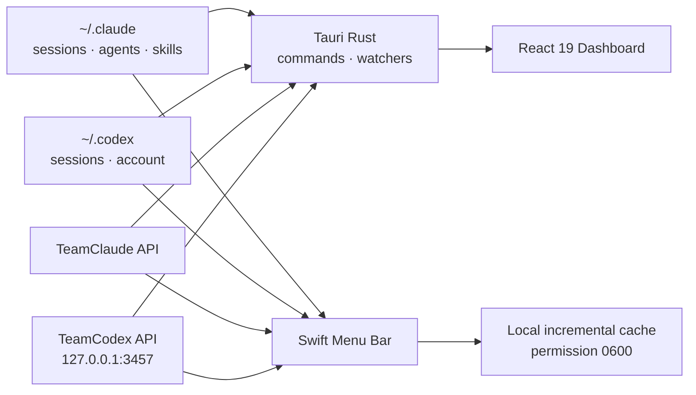

# CC Visualizer

> Claude Code와 Codex 운영 상태를 한 화면에서 확인하는 macOS 네이티브 관제 도구

[](https://v2.tauri.app/)
[](https://react.dev/)
[](https://www.typescriptlang.org/)
[](./menubar)
[](https://github.com/sangrokjung/cc-visualizer/releases/latest)

CC Visualizer는 Claude Code의 에이전트·스킬·훅·룰·파이프라인을 시각화하고, Claude/Codex 계정 상태와 토큰 사용량을 실시간에 가깝게 보여주는 Tauri 데스크톱 앱입니다. 별도의 Swift 메뉴바 앱을 함께 제공해 대시보드를 열지 않아도 사용량과 계정 풀 상태를 확인할 수 있습니다.

## 핵심 기능

| 영역 | 제공 기능 |
|---|---|
| 시스템 시각화 | Dashboard, Agent Map, Agent Office, Architecture, Catalog, Process |
| 실시간 모니터링 | Claude Code JSONL 세션 tail, 도구 호출·에이전트 활동·토큰 흐름 |
| 사용량 분석 | 오늘·주간·월간·누적 비용, USD/KRW 환산, 제공자·모델별 집계 |
| AI 계정 진단 | TeamClaude와 TeamCodex 서버 상태, 계정별 5시간/7일 사용량, 동시 요청 |
| macOS 메뉴바 | Claude/Codex 사용량, reset 남은 시간, 모델 현황, 계정 추가·전환 상태 |
| 메뉴바 대시보드 | 한 장으로 이어지는 스크롤 페이지, 현재 섹션을 알려주는 고정 헤더, 계정 측정·복구 버튼 |
| CLI 쿼터 | Grok 잔량과 Antigravity(Gemini) 주간 잔량을 메뉴바 제목과 카드에 표시 |
| 외부 크레딧 | Higgsfield 크레딧 잔액과 재구독 D-day |
| 운영 진단 | 프록시 빌드·가동 시간·워커 재시작 수, 크래시 기록, 갱신 비용 로그 |
| 직원 배포 | macOS arm64 DMG와 메뉴바 ZIP을 GitHub Release로 자동 생성 |

### 2026-09 업데이트

- 메뉴가 섹션마다 따로 스크롤되던 구조를 없애고 **한 장으로 이어지는 페이지**로 바꿨습니다. 계정이 늘어도 표가 잘리지 않고 페이지째 스크롤됩니다.
- 스크롤 중에도 지금 보고 있는 섹션의 제목과 요약이 상단에 고정됩니다.
- TeamCodex 풀에 쓸 수 있는 계정이 하나도 없으면 `소진`으로 표시하고, 메뉴바 제목에 복구 예정 시각을 함께 보여줍니다.
- 프록시가 보내주면 빌드 식별자·가동 시간·워커 재시작 수를 표와 카드에 표시합니다.
- 그리기 도중 예외가 나면 시각·사유·직전 구간을 `~/.claude/cache/cc-menubar-crash.log`에 남깁니다.
- 세션 통계를 날짜별로 쌓아 자정이 지나도 파일을 다시 읽지 않습니다. 갱신 비용은 `DASHBOARD-REFRESH` 로그에 단계별로 남습니다.
- LaunchAgent를 `Interactive`로 스케줄합니다. 부하가 높은 맥에서 메뉴가 굼뜨던 원인이 여기였습니다.

### 2026-07 업데이트

- TeamCodex 다계정 풀을 앱의 **AI 계정 진단**과 macOS 메뉴바에 연결했습니다.
- Codex 계정별 5시간·7일 사용률과 reset 남은 시간을 표시하고, 한도 도달 계정을 구분합니다.
- Claude/Codex/Gemini를 제공자·모델별로 분리해 월간 비용과 토큰을 집계합니다.
- Codex 세션 로그를 증분 캐시해 메뉴 클릭 때 전체 로그를 다시 읽지 않도록 개선했습니다.
- 메뉴 UI를 사전 구성해 반복 클릭 시 즉시 열리고, 새 데이터만 비동기로 반영됩니다.

## 동작 구조



데스크톱 앱은 Tauri command와 file watcher를 통해 로컬 데이터를 읽고, React 화면은 zod 스키마로 IPC 경계를 검증합니다. Swift 메뉴바는 독립 실행되며 Codex 세션 통계와 메뉴 구성을 로컬 캐시에 보관합니다. OAuth credential 원문은 화면이나 캐시에 저장하지 않습니다.

## 빠른 시작

### 요구사항

- macOS
- Node.js 20+
- Rust stable
- Xcode Command Line Tools

```bash
git clone https://github.com/sangrokjung/cc-visualizer.git
cd cc-visualizer
npm ci
npm run tauri dev
```

브라우저 UI만 확인하려면 다음 명령을 사용합니다.

```bash
npm run dev
```

### macOS 메뉴바 앱

설치 스크립트 한 번이면 빌드와 로그인 자동 시작 등록까지 끝납니다.

```bash
bash menubar/install.sh
```

스크립트가 하는 일은 네 가지입니다.

1. 옆에 바이너리가 없으면 `menubar/build.sh`를 먼저 돌립니다. 이때 Swift·Python 테스트가 함께 돌고, 하나라도 실패하면 바이너리를 만들지 않으므로 설치도 멈춥니다. 릴리스 zip에는 바이너리가 들어 있어 이 단계를 건너뜁니다.
2. 바이너리를 `~/Applications/cc-menubar/`에 복사합니다. 경로를 바꾸려면 `--install-dir <경로>`를 줍니다.
3. LaunchAgent(`~/Library/LaunchAgents/com.qjc.cc-menubar.plist`)를 만들어 로그인 시 자동 시작하도록 등록합니다.
4. 데몬을 띄웁니다. 비정상 종료 시 자동으로 다시 뜹니다.

설치하지 않고 한 번만 띄워 보려면 다음으로 충분합니다.

```bash
bash menubar/build.sh
./menubar/.build/cc-menubar
```

| 항목 | 경로 |
|---|---|
| 설치 위치 | `~/Applications/cc-menubar/` |
| 자동 시작 설정 | `~/Library/LaunchAgents/com.qjc.cc-menubar.plist` |
| 실행 로그 | 설치 폴더의 `cc-menubar.log`, `cc-menubar.error.log` |
| 크래시 기록 | `~/.claude/cache/cc-menubar-crash.log` (없으면 정상) |
| 세션 통계 캐시 | `~/.codex/cache/cc-menubar-session-stats-v4.json` |

업데이트는 같은 스크립트를 다시 실행하면 됩니다. 제거하려면 자동 시작을 내리고 설치 폴더를 지웁니다.

```bash
launchctl bootout gui/$(id -u)/com.qjc.cc-menubar
rm -rf ~/Applications/cc-menubar ~/Library/LaunchAgents/com.qjc.cc-menubar.plist
```

빌드 도구 없이 받아서 쓰려면 [Releases](https://github.com/sangrokjung/cc-visualizer/releases/latest)의 `cc-menubar-<tag>.zip`을 풀고 그 안의 `install.sh`를 실행하세요. 직원 배포 절차는 [설치 가이드](./docs/INSTALL-for-employees.md)에 있습니다.

### 메뉴바 화면 구성

메뉴바 제목은 왼쪽부터 CLI 쿼터(Grok, Antigravity), 그다음 5초마다 바뀌는 정보 슬롯입니다. 클릭하면 한 장으로 이어지는 대시보드가 열리고, 위에서부터 요약 카드와 다섯 섹션이 차례로 놓입니다.

| 섹션 | 내용 |
|---|---|
| Claude 풀 | 계정별 상태·5시간/7일 사용률·Fable 주간 한도, 측정과 재인증 버튼 |
| Codex 풀 | TeamCodex 계정별 사용률과 복구 예정 시각, 사용 가능·제외 집계 |
| Higgsfield | 크레딧 잔액과 재구독까지 남은 일수 |
| CLI 쿼터 | Grok, Antigravity 주간·5시간 잔량 |
| 사용량 | 오늘·주간·월간·누적 비용과 토큰, 일별 추이 |

스크롤하면 지금 보고 있는 섹션의 제목이 상단에 고정됩니다. 화면보다 내용이 짧으면 스크롤 없이 그대로 표시합니다.

## TeamClaude / TeamCodex 연동

AI 계정 진단 화면과 메뉴바는 로컬 런타임을 자동 감지합니다.

| 런타임 | 기본 확인 대상 | 표시 정보 |
|---|---|---|
| TeamClaude | 로컬 TeamClaude 상태 | 활성 계정, quota, Fable 주간 한도, 프록시 상태 |
| TeamCodex | `http://127.0.0.1:3457/teamclaude/status` | 계정 상태, 5시간/7일 사용률, reset, inflight, 요청·토큰 |
| Codex CLI | `~/.codex/sessions` | 현재 계정, 모델별 호출·토큰, 최근 활동 |

TeamCodex 서버가 꺼져 있거나 quota가 아직 측정되지 않은 계정은 값을 추측하지 않고 `오프라인` 또는 `—`로 표시합니다. 실제 quota는 upstream 응답 헤더가 들어온 뒤 갱신됩니다.

## 사용량과 환율

- `ccusage daily`, `weekly`, `monthly` 결과를 합쳐 오늘·주간·월간·누적 통계를 계산합니다.
- Claude, Codex, Gemini 등 provider와 model별 비용·토큰을 분리합니다.
- USD/KRW 환율은 공개 환율 API를 사용하고 12시간 로컬 캐시 후, 네트워크 실패 시 fallback 값을 사용합니다.
- 실사용 스냅샷과 개인별 통계 파일은 Git에 포함하지 않습니다.

## 반응속도 최적화

2026-07-24 로컬 대용량 세션 데이터 기준 측정이며, 실제 값은 세션 수와 디스크 상태에 따라 달라집니다.

| 경로 | 개선 전 | 개선 후 |
|---|---:|---:|
| Codex 세션 통계 새 프로세스 로드 | 약 111초 전체 스캔 | 약 42ms 증분 캐시 |
| 메뉴 재오픈 | 매번 전체 구성 | 약 5ms 사전 구성 메뉴 |
| 전체 상태 스냅샷 렌더 | 약 142초 | 약 0.26초 |

캐시는 `~/.codex/cache/cc-menubar-session-stats-v4.json`에 `0600` 권한으로 저장하며, 파일 크기·수정 시각이 바뀐 세션만 다시 읽습니다. 통계는 날짜별 버킷으로 쌓여서 날짜가 바뀌면 버킷을 다시 접을 뿐 파일을 다시 읽지 않습니다. 실제로 자정을 넘긴 첫 스캔이 744개 세션 중 8개만 다시 읽었습니다.

### 2026-09-23 추가 측정

메뉴가 굼뜬 원인은 코드가 아니라 스케줄링이었습니다. LaunchAgent 기본값인 `Standard`로 돌면 부하가 높은 맥에서 메인 스레드가 CPU를 거의 받지 못합니다.

| 상태 | 갱신 1회 CPU 시간 | 갱신 1회 실제 경과 |
|---|---:|---:|
| `ProcessType` 미지정 (기본 Standard) | 170~280ms | 2.6~6.3초 |
| `ProcessType=Interactive` | 90~124ms | 93~135ms |

두 측정 모두 load 200 안팎에서 잰 값입니다. 판별 근거는 `DASHBOARD-REFRESH` 로그의 `cpu=`와 `elapsed=` 차이입니다. 같이 적용한 것은 세 가지입니다. Codex 세션 스캔을 10초 틱에서 떼어 60초 주기 백그라운드로 옮겼고, 열린 대시보드 다시 그리기를 0.3초 단위로 합쳤고, 메뉴가 닫혀 있을 때는 30초에 한 번만 캐시를 데웁니다.

## 개발 명령

```bash
npm run build                         # TypeScript + Vite
npm test                              # Vitest
cargo test --manifest-path src-tauri/Cargo.toml
bash menubar/build.sh                 # Swift 메뉴바 컴파일
npm run scan                          # Claude 시스템 스냅샷 재생성
npm run scan:usage                    # 사용량 스냅샷 재생성
```

주요 디렉토리:

```text
src/renderer/src/     React UI와 데이터 집계
src-tauri/src/        Tauri IPC command와 file/session watcher
menubar/Sources/      Swift 메뉴바 앱
menubar/Tests/        Swift 로직 테스트
scripts/              로컬 Claude 시스템·사용량 스캐너
__tests__/            Vitest 테스트
docs/                 설치·배포 문서
```

## 배포

`v*` 태그를 push하면 [Release workflow](./.github/workflows/release.yml)가 다음 산출물을 생성합니다.

- macOS arm64 `.dmg`
- Tauri `.app.tar.gz`
- Swift 메뉴바 `cc-menubar-<tag>.zip`

최신 설치 파일은 [GitHub Releases](https://github.com/sangrokjung/cc-visualizer/releases/latest)에서 받을 수 있습니다. 현재 배포본은 미서명이므로 최초 실행 시 설치 가이드의 Gatekeeper 허용 절차가 필요합니다.

## 보안·개인정보

- OAuth token과 credential 원문을 UI, README, Git 스냅샷에 기록하지 않습니다.
- `.codex`, `.omo`, 개인 사용량 스냅샷과 이메일 초안은 Git에서 제외합니다.
- 로컬 캐시는 사용자만 읽을 수 있도록 `0600` 권한을 적용합니다.
- TeamCodex 상태 API는 기본적으로 localhost 경로만 사용합니다.

## 문서

- [직원 설치 가이드](./docs/INSTALL-for-employees.md)
- [기능 명세](./spec.md)
- [구현 계획](./prompt_plan.md)
- [qjc-webapp 다운로드 페이지 연동 스펙](./docs/qjc-webapp-download-page-spec.md)
